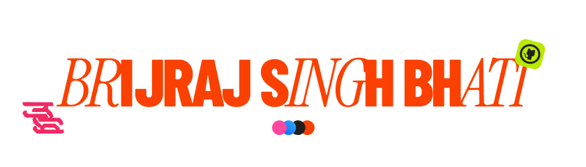
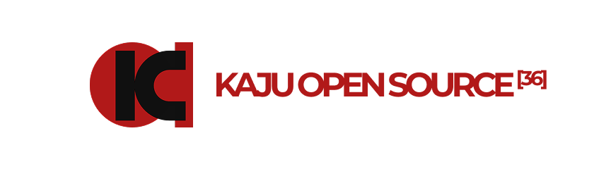

  

---

# Who am I?

I am Brijraj Singh Bhati, A Computer Engineering student at NMIMS, Mumbai.
I am a 3D Generalist, Filmaker, Motion Graphics Animator, Programmer, Designer, Who's worked on titles like:
- [Law of Machine Chapter 1](https://youtu.be/wwp79p-7YXU),
- [Wonder Cinematic Trailer](https://youtu.be/wXHJ0kUjw-A)

and many others.

---

## About Me

**Where Innovation Meets Me.**
Computer Engineering student building across software, hardware, and design. Developed mobile applications with React Native, web platforms with Next.js, custom developer tools such as X4MD, productivity & student tools, and experimental hardware including cyberdeck designs & IOT. Also leading and contributing to open-source initiatives such as The Kaju Taklis Open Source while creating technology-driven storytelling projects like Law Of Machine & Wonder.

---

## Currently Building

  

---
## Skills & Interests

  
  
  
  
  
  
  
  
  
  
  
  
  
  
  
  
  
  
  
  
  
  
  

---

## Projects

| Project | Category | Description |
|----------|----------|------------|
| **[X4](https://x4creative.framer.website)** | Portfolio | Personal portfolio and project hub |
| **[FANSI](https://github.com/laz4rd/FANSI-logger)** | Developer Tool | Java ANSI color logger with icons and formatting |
| **[X4MD](https://github.com/laz4rd/X4MD)** | AI / CLI | Pre-agentic LLM workflow with a Python TUI |
| **[GPA Calculator](https://github.com/laz4rd/GPACalc)** | Web App | GPA prediction and semester planning tool |
| **[T::Shll](https://github.com/laz4rd/tshll)** | AI / Terminal | Conversational AI directly in the terminal |
| **[Sugarplum.nvim](https://github.com/laz4rd/sugarplum.nvim)** | Open Source | Ghostty-inspired Neovim theme |
| **[Productivity Timer](https://github.com/laz4rd/Study-Productivity-Timer-with-built-in-A.O.D.)** | Productivity | Minimalist focus timer with A.O.D. support |

---

## Packages & Releases

| Project | Version | Description |
|----------|----------|------------|
| **[FANSI](https://github.com/laz4rd/FANSI-Logger/releases/tag/v1.0.0)** | v1.0.0 | A fancy Java ANSI color logger for styled CLI output with colors, icons, and formatting. Ready for Maven integration [mvn]. |

---

## Contact

- Portfolio: [COMING SOON]
- Website: https://lynxbrijraj.vercel.app/  
- Email: brijrajbhati123@gmail.com

---

  

